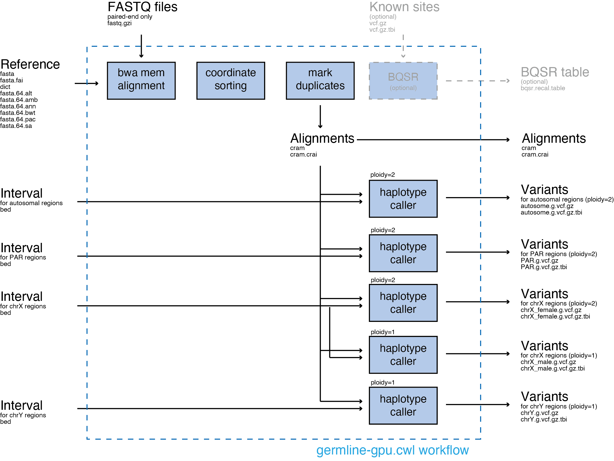

# NCGM WGS pipelien (Parabricks 4.0.0) の概要
`germline-gpu.cwl`: このワークフローを用いることで、シーケンスリード(fastqファイル)とリファレンスファイル(fastqファイル)から、アライメントとバリアントコールを行い、cramファイルとgvcfファイルを作成することができます。バリアントコールの結果は、設定したインターバルファイルや倍数性により分かれたファイルで出力されます。




参考資料
 [NVIDIA Clara Parabricks 公式サイト](https://www.nvidia.com/ja-jp/clara/genomics/)
[Clara Parabricks Documentation](https://docs.nvidia.com/clara/)
# 利用申請方法
個人ゲノム解析区画の利用申請を行い、parabricks用の解析環境(at022vm02)にログインできるように申請を行ってください。
その後、個人ゲノム区画へのゲートウェイへログイン後、以下のコマンドでparabricks用の解析環境へログインしてください。
```
ssh at022vm02 
```

# 環境構築
parabricksでの GATK 互換のゲノム解析パイプラインを実施するには、以下のワークフローを用いることで実施することができます。
https://github.com/NCGM-genome/WGSpipeline
具体的な手順を以下に紹介します。


## githubから解析に使用するワークフローをcloneする
Parabricksでの GATK 互換のゲノム解析パイプラインを実施するためのワークフローをインストールします。
以下のコマンドを実行することで、ワークフローをcloneすることができます。
```
$ cd /path/to/working/directory/
$ git clone https://github.com/NCGM-genome/WGSpipeline.git
```
## Download reference and resource files
以下のコマンドを実行することで、リファレンスとリソースファイルを[こちら](https://github.com/NCGM-genome/WGSpipeline/blob/main/download_links/reference_hg38.download_links.txt)のhg38のリンクよりダウンロードします。
```
$ cd /path/to/working/directory/
$ OUTDIR=reference_hg38 ; mkdir -p $OUTDIR ; for url in `cat WGSpipeline/download_links/reference_hg38.download_links.txt` ; do echo $url ; file=`basename $url` ; if [ ! -f ${OUTDIR}/$file ] ; then wget $url -O ${OUTDIR}/$file ; fi ; done
```

# 利用方法
## `germline-gpu.cwl`の利用方法
```
usage: Workflows/germline-gpu.cwl [-h] [--bwa_options STRING] \
                                    --ref FILE \
				    [--knownSites FILE] \
                                    --fq1 FILE \
                                    --fq2 FILE \
                                    --rg STRING \
                                    --autosome_interval FILE \
                                    --PAR_interval FILE \
                                    --chrX_interval FILE \
                                    --chrY_interval FILE \
                                    --num_gpus INT \
                                    --prefix STRING

optional arguments:
  -h, --help                Show this help message and exit.
  --bwa_options STRING      Pass supported bwa mem options as one string. 
                            The current original bwa mem supported options are -M, -Y, and -T. 
                            (e.g. --bwa-options="-M -Y") 
                            (default: "-T 0 -Y")
  --ref FILE                Path to the reference file.	
  --knownSites FILE         Path to a known indels file. 
  	       		    The file must be in vcf.gz format. 
			    This option can be used multiple times.
  --fq1 FILE                Path to FASTQ file 1.
			    This option can be used multiple times.
  --fq2 FILE                Path to FASTQ file 2.
			    This option can be used multiple times.
  --rg STRING               Read group string.
			    This option can be used multiple times.
  --autosome_interval FILE  Path to interval BED file for autosome regions.
  --PAR_interval FILE       Path to interval BED file for PAR regions.
  --chrX_interval FILE      Path to interval BED file for chrX regions.
  --chrY_interval FILE      Path to interval BED file for chrY regions.
  --num_gpus INT            Number of GPUs to use for a run (should be ≥1). 
  --prefix STRING           Output file prefix.
```
## チュートリアル用のデータセットのダウンロード
以下のコマンドを実行することで、チュートリアル用のデータセットを[こちら](https://github.com/NCGM-genome/WGSpipeline/blob/main/download_links/wgs_fastq_NA12878_20k.download_links.txt)のリンクよりダウンロードします。
```
$ cd /path/to/working/directory/
$ OUTDIR=wgs_fastq ; mkdir -p $OUTDIR ; for url in `cat WGSpipeline/download_links/wgs_fastq_NA12878_20k.download_links.txt` ; do echo $url ; file=`basename $url` ; if [ ! -f ${OUTDIR}/$file ] ; then wget $url -O ${OUTDIR}/$file ; fi ; done
```
## Tutorial 1: 1ペアのFASTQファイルでの`germline-gpu.cwl` の実施
Tutorial 1 では、1ペアのFASTQファイルでの`germline-gpu.cwl` を実施します。
`/path/to/working/directory/tutorial1.sh` を下記のように作成します。
```{sh:/path/to/working/directory/tutorial1.sh}
#!/bin/bash
#
#SBATCH --partition=igt009
#SBATCH --ntasks=1
#SBATCH --cpus-per-task=48
#SBATCH --job-name=tutorial1
#SBATCH --output=tutorial1.log
#SBATCH --mem 384000
cd /path/to/working/directory
mkdir -p tutorial_01
cwltool --singularity \
    --outdir tutorial_01 \
    WGSpipeline/Workflows/germline-gpu.cwl \
    --ref reference_hg38/Homo_sapiens_assembly38.fasta \
    --fq1 wgs_fastq/H06HDADXX130110.1.ATCACGAT.20k_reads_1.fastq \
    --fq2 wgs_fastq/H06HDADXX130110.1.ATCACGAT.20k_reads_2.fastq \
    --rg "@RG\\tID:NA12878.H06HDADXX130110.1\\tPL:ILLUMINA\\tPU:H06HDADXX130110.1\\tLB:H06HDADXX130110.1\\tSM:NA12878" \
    --num_gpus 4 \
    --prefix NA12878.H06HDADXX130110.1 \
    --autosome_interval WGSpipeline/interval_files/autosome.bed \
    --PAR_interval WGSpipeline/interval_files/PAR.bed \
    --chrX_interval WGSpipeline/interval_files/chrX.bed \
    --chrY_interval WGSpipeline/interval_files/chrY.bed
```
その後以下のコマンドで解析を行います。
```
$ cd /path/to/working/directory
$ sbatch tutorial1.sh
```
--knownSites option を使用しない場合は、空のBQSR tableファイル(.bqsr.recla.table)が作成されます。

出力ファイルは以下のディレクトリへ保存されます。

```
/path/to/working/directory/tutorial_01
|--NA12878.H06HDADXX130110.1.PAR.g.vcf.gz
|--NA12878.H06HDADXX130110.1.PAR.g.vcf.gz.tbi
|--NA12878.H06HDADXX130110.1.autosome.g.vcf.gz
|--NA12878.H06HDADXX130110.1.autosome.g.vcf.gz.tbi
|--NA12878.H06HDADXX130110.1.bqsr.recal.table
|--NA12878.H06HDADXX130110.1.chrX_female.g.vcf.gz
|--NA12878.H06HDADXX130110.1.chrX_female.g.vcf.gz.tbi
|--NA12878.H06HDADXX130110.1.chrX_male.g.vcf.gz
|--NA12878.H06HDADXX130110.1.chrX_male.g.vcf.gz.tbi
|--NA12878.H06HDADXX130110.1.chrY.g.vcf.gz
|--NA12878.H06HDADXX130110.1.chrY.g.vcf.gz.tbi
|--NA12878.H06HDADXX130110.1.cram
|--NA12878.H06HDADXX130110.1.cram.crai
```
## Tutorial 2: 複数ペアのFASTQファイルでの`germline-gpu.cwl` の実施
Tutorial 2 では、複数ペアのFASTQファイルでの`germline-gpu.cwl` を実施します。

--fq1、--fq2、--rgのオプションは何度も繰り返して使用することができます。--fq1のオプションの数は--fq2、--rgのオプションの数と一致させる必要があり、--fq1、--fq2、--rgの順番で記載してください。
`/path/to/working/directory/tutorial2.sh` を下記のように作成します。
```{sh:/path/to/working/directory/tutorial2.sh}
#!/bin/bash
#
#SBATCH --partition=igt009
#SBATCH --ntasks=1
#SBATCH --cpus-per-task=48
#SBATCH --job-name=tutorial2
#SBATCH --output=tutorial2.log
#SBATCH --mem 384000
cd /path/to/working/directory
mkdir -p tutorial_02
cwltool --singularity \
    --outdir tutorial_02 \
    WGSpipeline/Workflows/germline-gpu.cwl \
    --ref reference_hg38/Homo_sapiens_assembly38.fasta \
    --fq1 wgs_fastq/H06HDADXX130110.1.ATCACGAT.20k_reads_1.fastq \
    --fq2 wgs_fastq/H06HDADXX130110.1.ATCACGAT.20k_reads_2.fastq \
    --rg "@RG\\tID:NA12878.H06HDADXX130110.1\\tPL:ILLUMINA\\tPU:H06HDADXX130110.1\\tLB:H06HDADXX130110.1\\tSM:NA12878" \
    --fq1 wgs_fastq/H06HDADXX130110.2.ATCACGAT.20k_reads_1.fastq \
    --fq2 wgs_fastq/H06HDADXX130110.2.ATCACGAT.20k_reads_2.fastq \
    --rg "@RG\\tID:NA12878.H06HDADXX130110.2\\tPL:ILLUMINA\\tPU:H06HDADXX130110.2\\tLB:H06HDADXX130110.2\\tSM:NA12878" \
    --fq1 wgs_fastq/H06JUADXX130110.1.ATCACGAT.20k_reads_1.fastq \
    --fq2 wgs_fastq/H06JUADXX130110.1.ATCACGAT.20k_reads_2.fastq \
    --rg "@RG\\tID:NA12878.H06JUADXX130110.1\\tPL:ILLUMINA\\tPU:H06JUADXX130110.1\\tLB:H06JUADXX130110.1\\tSM:NA12878" \
    --num_gpus 4 \
    --prefix NA12878 \
    --autosome_interval WGSpipeline/interval_files/autosome.bed \
    --PAR_interval WGSpipeline/interval_files/PAR.bed \
    --chrX_interval WGSpipeline/interval_files/chrX.bed \
    --chrY_interval WGSpipeline/interval_files/chrY.bed
```
その後以下のコマンドで解析を行います。
```
$ cd /path/to/working/directory
$ sbatch tutorial2.sh
```
出力ファイルは以下のディレクトリへ保存されます。
```
/path/to/working/directory/tutorial_02
|--NA12878.PAR.g.vcf.gz
|--NA12878.PAR.g.vcf.gz.tbi
|--NA12878.autosome.g.vcf.gz
|--NA12878.autosome.g.vcf.gz.tbi
|--NA12878.bqsr.recal.table
|--NA12878.chrX_female.g.vcf.gz
|--NA12878.chrX_female.g.vcf.gz.tbi
|--NA12878.chrX_male.g.vcf.gz
|--NA12878.chrX_male.g.vcf.gz.tbi
|--NA12878.chrY.g.vcf.gz
|--NA12878.chrY.g.vcf.gz.tbi
|--NA12878.cram
|--NA12878.cram.crai
```

## Tutorial 3: --knownSitesオプションを用いての`germline-gpu.cwl` の実施
Tutorial 3 では、--knownSitesオプションを用いての`germline-gpu.cwl` を実施します。
`/path/to/working/directory/tutorial3.sh` を下記のように作成します。
```{sh:/path/to/working/directory/tutorial3.sh}
#!/bin/bash
#
#SBATCH --partition=igt009
#SBATCH --ntasks=1
#SBATCH --cpus-per-task=48
#SBATCH --job-name=tutorial3
#SBATCH --output=tutorial3.log
#SBATCH --mem 384000
cd /path/to/working/directory
mkdir -p tutorial_03
cwltool --singularity \
    --outdir tutorial_03 \
    WGSpipeline/Workflows/germline-gpu.cwl \
    --ref reference_hg38/Homo_sapiens_assembly38.fasta \
    --knownSites reference_hg38/Mills_and_1000G_gold_standard.indels.hg38.vcf.gz \
    --knownSites reference_hg38/Homo_sapiens_assembly38.known_indels.vcf.gz \
    --fq1 wgs_fastq/H06HDADXX130110.1.ATCACGAT.20k_reads_1.fastq \
    --fq2 wgs_fastq/H06HDADXX130110.1.ATCACGAT.20k_reads_2.fastq \
    --rg "@RG\\tID:NA12878.H06HDADXX130110.1\\tPL:ILLUMINA\\tPU:H06HDADXX130110.1\\tLB:H06HDADXX130110.1\\tSM:NA12878" \
    --fq1 wgs_fastq/H06HDADXX130110.2.ATCACGAT.20k_reads_1.fastq \
    --fq2 wgs_fastq/H06HDADXX130110.2.ATCACGAT.20k_reads_2.fastq \
    --rg "@RG\\tID:NA12878.H06HDADXX130110.2\\tPL:ILLUMINA\\tPU:H06HDADXX130110.2\\tLB:H06HDADXX130110.2\\tSM:NA12878" \
    --fq1 wgs_fastq/H06JUADXX130110.1.ATCACGAT.20k_reads_1.fastq \
    --fq2 wgs_fastq/H06JUADXX130110.1.ATCACGAT.20k_reads_2.fastq \
    --rg "@RG\\tID:NA12878.H06JUADXX130110.1\\tPL:ILLUMINA\\tPU:H06JUADXX130110.1\\tLB:H06JUADXX130110.1\\tSM:NA12878" \
    --num_gpus 4 \
    --prefix NA12878 \
    --autosome_interval WGSpipeline/interval_files/autosome.bed \
    --PAR_interval WGSpipeline/interval_files/PAR.bed \
    --chrX_interval WGSpipeline/interval_files/chrX.bed \
    --chrY_interval WGSpipeline/interval_files/chrY.bed
```
```
$ cd /path/to/working/directory
$ sbatch tutorial3.sh
```
--knownSites option を使用した場合は、空でないBQSR tableファイル(.bqsr.recla.table)が作成されます。しかしながら、出力されるcramファイルはBQSRが適用されていないことにご注意ください。

出力ファイルは以下のディレクトリへ保存されます。
```
/path/to/working/directory/tutorial_03
|--NA12878.PAR.g.vcf.gz
|--NA12878.PAR.g.vcf.gz.tbi
|--NA12878.autosome.g.vcf.gz
|--NA12878.autosome.g.vcf.gz.tbi
|--NA12878.bqsr.recal.table
|--NA12878.chrX_female.g.vcf.gz
|--NA12878.chrX_female.g.vcf.gz.tbi
|--NA12878.chrX_male.g.vcf.gz
|--NA12878.chrX_male.g.vcf.gz.tbi
|--NA12878.chrY.g.vcf.gz
|--NA12878.chrY.g.vcf.gz.tbi
|--NA12878.cram
|--NA12878.cram.crai
```


